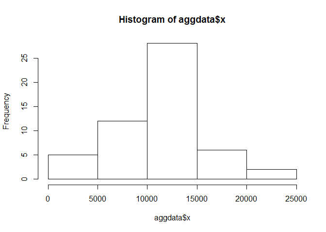
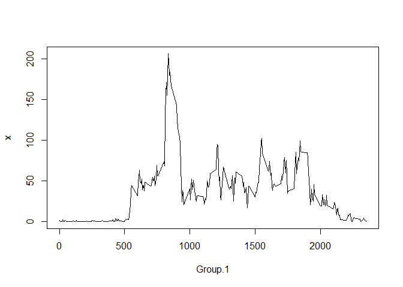
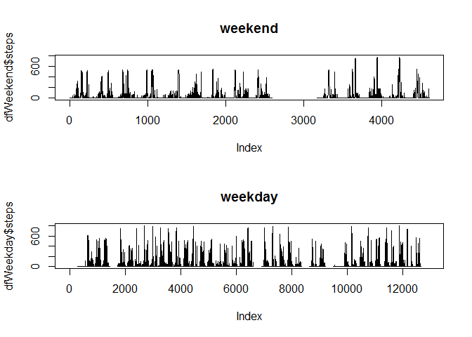

# Reproducible Research: Peer Assessment 1
## dont forget to install "rmarkdown" package

## Loading and preprocessing the data

```r
df <- read.csv("activity.csv")

## What is mean total number of steps taken per day?
aggdata <- aggregate(df$steps,list(df$date),sum)
hist(aggdata$x)
```

 

```r
mean(aggdata$x, na.rm = TRUE)
```

```
## [1] 10766.19
```

```r
median(aggdata$x, na.rm = TRUE)
```

```
## [1] 10765
```

```r
## What is the average daily activity pattern?
aggByTime = aggregate(df$steps, list(df$interval), mean, na.rm = TRUE)
plot(aggByTime, type = "l")
```

 

```r
# 5 min interval which contains the max number of steps
which.max(aggByTime$x)
```

```
## [1] 104
```

```r
## Imputing missing values
# # of missing values
nrow(df)-sum(complete.cases(df))
```

```
## [1] 2304
```

```r
## Are there differences in activity patterns between weekdays and weekends?
#df$day <- apply(df, 1, function(row){
#  if (weekdays(as.Date(row[2]))) %in% #c('Saturday','Sunday') {
#    return("Weekend")
#  }
#  else {
#    return("weekday")
#  }
#})

df$check <- ifelse(weekdays(as.Date(df$date)) %in% c('土曜日','日曜日'),"Weekend","Weekday")
head(df)
```

```
##   steps       date interval   check
## 1    NA 2012-10-01        0 Weekday
## 2    NA 2012-10-01        5 Weekday
## 3    NA 2012-10-01       10 Weekday
## 4    NA 2012-10-01       15 Weekday
## 5    NA 2012-10-01       20 Weekday
## 6    NA 2012-10-01       25 Weekday
```

```r
dfWeekday <- subset(df, df$check == "Weekday")
dfWeekend <- subset(df, df$check == "Weekend")

head(dfWeekend)
```

```
##      steps       date interval   check
## 1441     0 2012-10-06        0 Weekend
## 1442     0 2012-10-06        5 Weekend
## 1443     0 2012-10-06       10 Weekend
## 1444     0 2012-10-06       15 Weekend
## 1445     0 2012-10-06       20 Weekend
## 1446     0 2012-10-06       25 Weekend
```

```r
par(mfrow=c(2,1))
plot(dfWeekend$steps, type = "l")
title(main = "weekend")
plot(dfWeekday$steps, type = "l")
title(main = "weekday")
```

 
